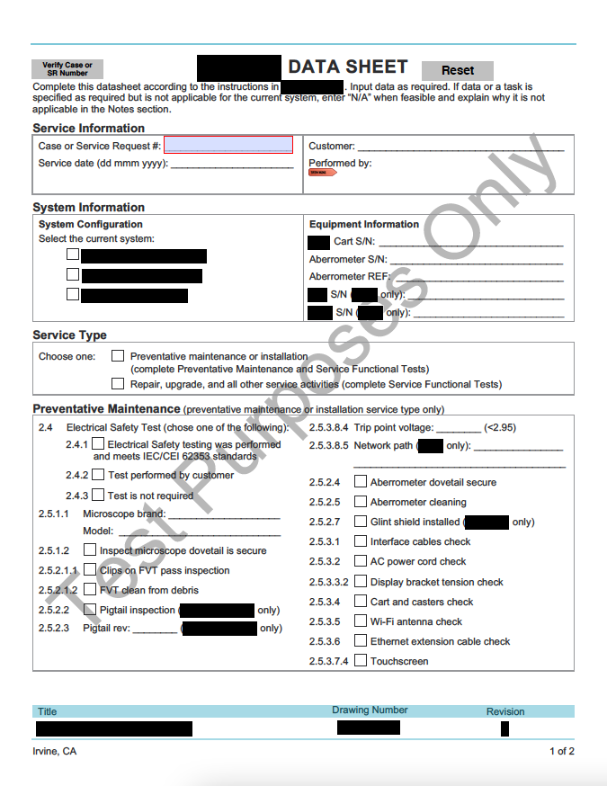
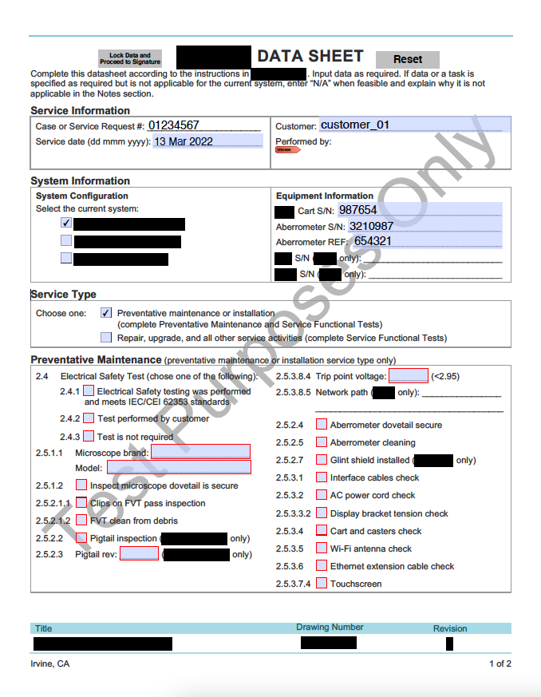
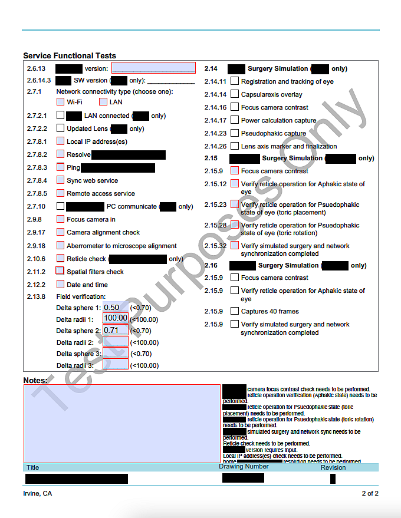

## Summary

The following excerpts are examples of custom input validation I applied to a Microsoft Word checklist. The checklist corresponds to a test procedure independently developed by a technical service engineer. The engineer also makes the checklist and requests automated input validation for a digital copy to be provided to internal field service engineers.

Basic principles of the input validation are defined by a user requirement specification, but individual limits and criteria are defined locally on the checklist or in the test procedure. Changes to the test or layout of the checklist or test procedure are not allowed. The checklist is an internal document, so the excerpts are intended to only demonstrate the flow and validation the JavaScript controls.

## Responsibilities

My responsibilities were to convert the checklist to a PDF (requirement of the Technical Services department), control the user workflow, apply input validation, and immediately notify users of issues. I used a limited set of JavaScript commands as defined by Adobe and Acrobat.

## Target Audience

* Field service engineers
* Technical service engineers
* Quality control engineers

## Tools

Microsoft Word

## Samples

*Product Information Required First*

*Required Fields Depend on System Information and Service Type*

*Numerical Limits Defined and Notes Regarding Required Action Appear in Real Time*
